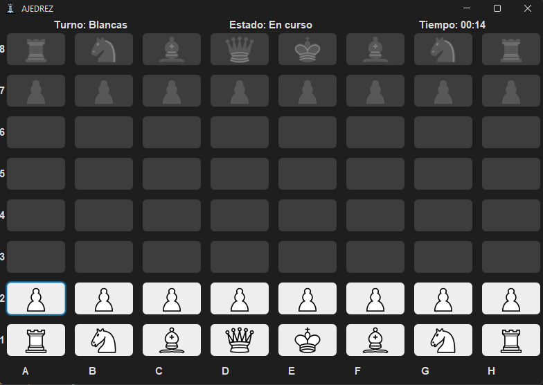

## ♟️Juego de ajedrez♟️

### 👀Interfaz de juego:

    

Detalles : 
- Juego de ajedrez para dos personas en el mismo ordenador/computadora
- Desarrollado completamente en java
- Interfaz JavaSwing
- Utiliza iconos sacados de <a href="https://es.wikipedia.org/wiki/Ajedrez">wikipedia</a>
- Las fuente utilizadas son tanto "Arial" como <a href="https://www.dafont.com/es/signlode.font">"Signlode"</a>
